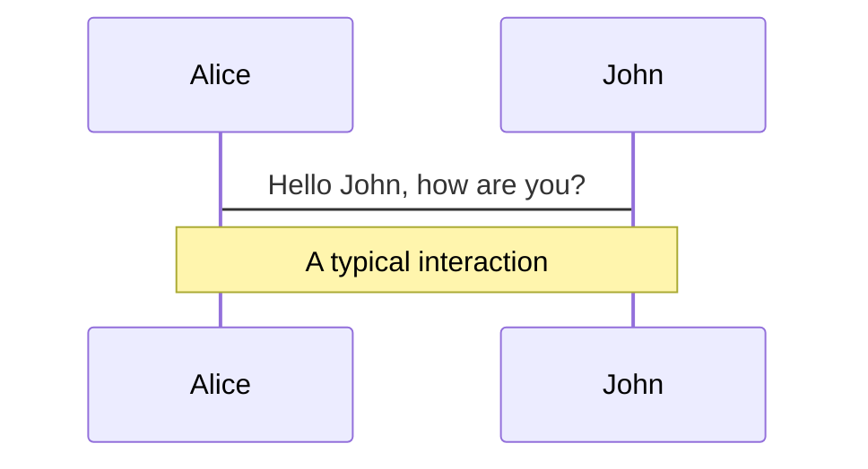
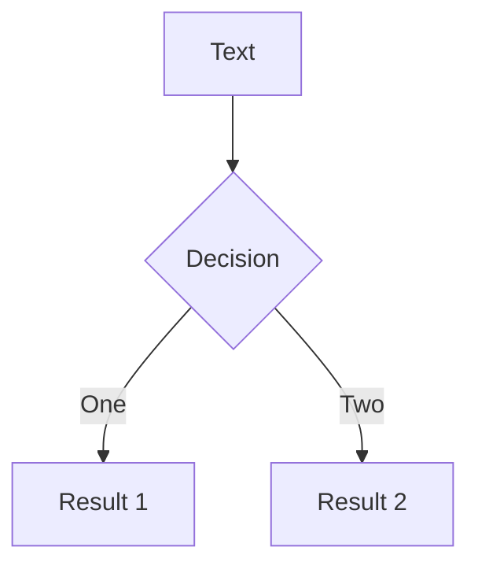
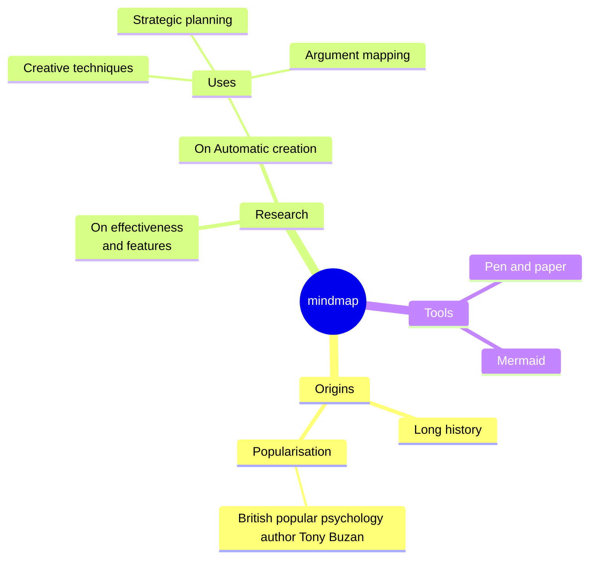
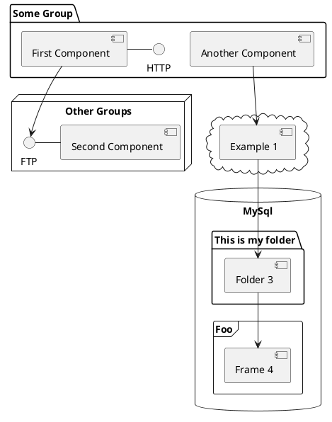

---
# try also 'default' to start simple
theme: default
# random image from a curated Unsplash collection by Anthony
# like them? see https://unsplash.com/collections/94734566/slidev
background: /assets/title-background.webp
# some information about your slides (markdown enabled)
title: w3geo – schauen Sie uns in die Karten
# apply UnoCSS classes to the current slide
class: text-center
# https://sli.dev/features/drawing
drawings:
  persist: false
# slide transition: https://sli.dev/guide/animations.html#slide-transitions
transition: slide-left
# enable Comark Syntax: https://comark.dev/syntax/markdown
comark: true
# duration of the presentation
duration: 7min
---

# Schauen Sie uns in die Karten!

Our Maps on The Table — OpenLayers in Web Applications


<!--
Willkommen! Wir von w3geo wollen euch heute einen kleinen Einblick in unsere Sicht auf räumliche
Informationen geben, und welche Lösungen wir mit unseren Kunden erarbeitet haben, um sie in
Erkenntnis- und Arbeitsprozesse zu integrieren.
-->

---
layout: two-cols
layoutClass: gap-10 items-center
---

# w3geo GmbH

Professionally sound web map applications with OpenLayers

- A well-rounded mix of expertise: spatial planning, geography, telematics
- Open source: core developers of OpenLayers and other projects
- Decades of experience building web applications

::right::

<div class="flex justify-center mb-6">
  
</div>

<div class="grid grid-cols-2 gap-6">
  <div class="text-center">
    
    <p class="mt-2 text-sm font-medium">Andreas Hocevar</p>
  </div>
  <div class="text-center">
    
    <p class="mt-2 text-sm font-medium">Robert Orthofer</p>
  </div>
</div>

<!--
Wir sind ein Team aus Raumplanern, Geoinformatikern und Telematikern, die es sich zum Ziel gemacht haben,
mit Hilfe von Software Planungsprozesse einfach, verständlich und transparent zu machen. Als ideales Mittel
dazu sehen wir interaktive Karten und Open Source Software im Web Browser.
-->

---
layout: center
class: text-center
---

# Maps, Context, Controls

<div class="mt-6 mx-auto" style="height: 440px; aspect-ratio: 16 / 9;">
  <MapCarousel
    :interval="2000"
    :images="[
      'austrianmap-oesterreich',
      'austrianmap-wien',
      'histmap-wien-sepia',
      'histmap-wien-gruen',
      'kataster-detail',
      'mrtis-stroemung',
      'agraratlas-hangneigung',
      'agraratlas-ortho',
      'ui-hangneigung-legende',
      'ama-ackerland',
      'ama-gruenland-bio',
      'elab-kreisverkehr',
      'elab-strasse',
      'estrab-graz',
      'estrab-ort',
      'haltepunkt-tal',
      'ui-istmobil-tabelle',
      'waldatlas-funktionsflaechen',
      'waldatlas-steinschlag',
      'ui-steinschlag-info',
      'waldinventur-baumarten',
      'ui-bodenform-info',
      'ui-pv-dialog',
      'ui-pv-popup',
      'ui-mobile-gza',
    ]"/>
</div>

<!--
Einige dieser Applikationen seht ihr hier im Schnelldurchlauf. Die Karten sind interaktiv. Je nach Kontext sind
mit Klicks in die Karte unterschiedliche Aktionen verknüpft. Das kann zum Beispiel Detailinformation zum geklickten
Punkt sein, oder eine Editieraktion. Im Gegensatz zu einem GIS kann man genau das zeigen, was zum Gewinnen von
Erkenntnis oder im jeweiligen Arbeitsablauf ideal ist. Also weg von klassischen Tabellen mit Attribut-Information hin
zu maßgeschneidertem Inhalt.

Das Ziel: niederschwellige Information für unbedarfte Benutzer, effiziente Workflows für Experten.
-->

---
layout: center
class: flex flex-col items-center gap-8 text-center
---

# Editing, better than in GIS

<video class="rounded-lg shadow-lg h-100" autoplay loop muted playsinline>
  <source src="/assets/gip-edit-trimmed.mp4" type="video/mp4" />
</video>

<!--
Editieren von Geodaten kann sehr abstrakt sein. Hier seht ihr einen Editiervorgang, wo an einem Straßenabschnitt
die Nutzungsstreifen bearbeitet werden. Dazu haben wir eine Darstellung gewählt, welche die einzelnen Nutzungen
so darstellt, wie sie in der Natur aussehen. Außérdem haben wir rechts eine Ansicht des Straßenprofils, die mit
der Karte synchronisiert ist. Abstände von der Straßenachse, Breiten und die Länge der Abschnitte lassen sich so
sehr intuitiv editieren.
-->

---
transition: fade-out
disabled: true
---

---
layout: center
class: flex flex-col items-center gap-8 text-center
---
# It's not *just* Eye Candy 🍬

<video class="rounded-lg shadow-lg h-100" autoplay loop muted playsinline>
  <source src="/assets/waldschaden_2026.mp4" type="video/mp4" />
</video>


 <!-- 
  Ein paar Punkte von mir zur Web-Kartographie: 
  "Eye Candy" ist in dieser Branche zu Unrecht negativ konnotiert. 
  
Eye Candy soll (im Unterschied zu einem "Eye Catcher") den Nutzer halten und fokussieren. 

Hier im Hintergrund seht ihr die neue "Waldschaden"-Applikation des BFW, in diesem Beispiel konkret eine satellitengestützte Modellierung von Schadensflächen bzw. das Eintrittsdatum von Schäden. Geotemporale Daten sind von vornherein bereits schwierig zu fassen, umso wichtiger ist, dass die Applikation möglichst intuitiv und greifbar ist.

  Farbskalen über chroma js 
    viridis / plasma / inferno / ...

    Perceptually uniform: 
    Colorblind-friendly.
    Readable in grayscale.
    Aesthetically pleasing

  Wir wollen Spaß statt Frust, kartographisch "richtige" Darstellungen ohne langweilig zu sein

  Sehr einfache Entscheidungen wie die Farblegende direkt über der  Zeitauswahl können den Unterschied zwischen einem langweiligem Profi-GIS-Tool mit vielen Menüs und einer spannenden Speziallösung sein
 -->
 
---
transition: fade-out
disabled: true
---

---
layout: center
class: flex flex-col items-center gap-8 text-center
---

# Show the users what they really want to see

<video class="rounded-lg shadow-lg h-100" autoplay loop muted playsinline>
  <source src="/assets/gza_2026.mp4" type="video/mp4" />
</video>

<!-- 
  Wer sind "die Nutzer"? Nicht irgendwelche gesichtslosen Phantome, auch die Verwalter im Backend sind "User", auch für die dürfen Freude empfinden, wenn sie "ihr" Tool benutzen. 

  Für "externe" Benutzer: Je spezifischer die Applikation, desto genauer kann der Benutzer definiert werden und desto besser kann die "User Experience" zugeschnitten werden. Und wenn die Applikation gut zugeschnitten ist, steigt auch die "Akzeptanz" der Applikation


  Bei einem kleinen (Experten)-Benutzerkreis kommt es zu vereinheitlichte Benutzerwünsche / Gewohnheiten. Hier in bei der Gewässerzustands-Erhebungsapplikation vom Land niederösterreich haben wir eine sehr abstrakte, symbolische Signatur im Unterschied zu den ikonischen Signaturen wie z.B. bei Estrab vorhin. Die Benutzer präferieren die maximale Unterscheidbarkeit und Benutzbarkeit im Feld bei Aufnahmen in unwegsamen Gelände anstelle einer "realitätsnahen" Darstellung
-->

---
layout: center
---

# The Web Browser as Platform

* no installation of additional software needed
* possible offline functionality
* well-known environment for the user
* user interface for a larger audience than desktop-GIS


<!-- 
  großes Stichwort "Niederschwelligkeit" 
  Das Web wird immer mächtiger, je mehr das Web kann, desto mehr sinkt die Akzeptanz von nativen Applikationen.
  Applikationen im Web werden noch mächtiger als PWAs, damit sind auch wichtige Zusatzfeatures wie Offline-Fähigkeit möglich

  Der Benutzer ist in seiner gewohnten Umgebung, er weiß was Links- und Rechtsklick machen, kann Bookmarks setzen, Content Teilen.
  Benutzer mit besonderen Bedürfnissen haben Schriftgröße, Screenreader oder Dark Theme bereits im Browser definiert, Applikationen können ohne großen Mehraufwand barrierefrei gestaltet werden.

  Die Benutzer können in eine Applikation einsteigen und sich sofort zuhause fühlen. Apropos wie zuhause fühlen, wir als w3geo sind bei der AGIT an unserem Stand zuhause, wir freuen uns nach der Fragerund auf alle Besucher!
-->
---
layout: center
class: text-center
---

# Danke für die Aufmerksamkeit

<div class="flex justify-center gap-16 mt-8">
  <div>
    <p class="font-medium">Andreas Hocevar</p>
    <a href="mailto:ahocevar@w3geo.at" class="flex items-center justify-center gap-1 mt-1 text-sm opacity-70 hover:opacity-100">
      <span class="i-carbon:email" />ahocevar@w3geo.at
    </a>
  </div>
  <div>
    <p class="font-medium">Robert Orthofer</p>
    <a href="mailto:rorthofer@w3geo.at" class="flex items-center justify-center gap-1 mt-1 text-sm opacity-70 hover:opacity-100">
      <span class="i-carbon:email" />rorthofer@w3geo.at
    </a>
  </div>
</div>

<div class="flex flex-col items-center gap-3 mt-12">
  <a href="https://w3geo.at/" class="flex items-center justify-center gap-1 text-lg opacity-80 hover:opacity-100">
    <span class="i-carbon:earth" />w3geo.at
  </a>
  <QRCode class="w-40" />
</div>

---
layout: center
class: text-center
---

# Workshop-Links und Unterlagen

<div class="flex flex-col items-center gap-3 mt-8">
  <a href="https://github.com/w3geo/agit-2026/tree/main/public/demos" target="_blank" class="flex items-center justify-center gap-2 text-lg opacity-80 hover:opacity-100">
    <span class="i-carbon:logo-github" />Quellcode aller Beispiele · github.com/w3geo/agit-2026 (public/demos)
  </a>
  <a href="https://jsfiddle.net/" target="_blank" class="flex items-center justify-center gap-2 text-lg opacity-80 hover:opacity-100">
    <span class="i-carbon:code" />Live-Coding zum Mitmachen · jsfiddle.net
  </a>
</div>

---

# Zaunpfähle
  <style>
  .clipart {
    position: absolute;
    bottom: 100px;
    left: 40px;
  }
  </style>
  <DemoFrame src="./demos/draw-fence.html" title="Zaunpfähle" />

  

---

# Reichweite: Elektroauto
  <style>
  .clipart {
    position: absolute;
    bottom: 100px;
    left: 40px;
  }
  </style>
  <DemoFrame src="./demos/low-battery.html" title="Reichweite: Elektroauto" />

  

---

# Reichweite: Elektroauto (+ OSRM-Routing)
  
<DemoFrame 
  src="./demos/low-battery-routing.html" 
  title="Reichweite: Elektroauto (Routing)" 
/>

---

# nDOM

<div class="flex flex-wrap items-center gap-x-6 gap-y-1 text-sm">
  <a href="https://ahocevar.net/fossgis-2026/27" target="_blank" class="flex items-center gap-1 opacity-80 hover:opacity-100">
    <span class="i-carbon:launch" />Fortgeschrittene Web-Map Techniken rund um OpenLayers · FOSSGIS 2026
  </a>
  <a href="https://waldatlas.at/map/136" target="_blank" class="flex items-center gap-1 opacity-80 hover:opacity-100">
    <span class="i-carbon:launch" />Baumhöhenkarte · Waldatlas
  </a>
</div>
<DemoFrame src="./demos/ndom.html" title="nDOM" />

---

# Hangneigung

<a href="https://terrestris.github.io/fossgis2023/talks/2023-03-15-jansen-hocevar-openlayers-feature-frenzy.html#/spatial-analysis" target="_blank" class="flex items-center gap-1 text-sm opacity-80 hover:opacity-100">
  <span class="i-carbon:launch" />OpenLayers Feature Frenzy · FOSSGIS 2023
</a>

<DemoFrame src="./demos/gradient.html" title="Hangneigung" />

---
transition: fade-out
disabled: true
---

# What is Slidev?

Slidev is a slides maker and presenter designed for developers, consist of the following features

- 📝 **Text-based** - focus on the content with Markdown, and then style them later
- 🎨 **Themable** - themes can be shared and re-used as npm packages
- 🧑‍💻 **Developer Friendly** - code highlighting, live coding with autocompletion
- 🤹 **Interactive** - embed Vue components to enhance your expressions
- 🎥 **Recording** - built-in recording and camera view
- 📤 **Portable** - export to PDF, PPTX, PNGs, or even a hostable SPA
- 🛠 **Hackable** - virtually anything that's possible on a webpage is possible in Slidev
<br>
<br>

Read more about [Why Slidev?](https://sli.dev/guide/why)

<!--
You can have `style` tag in markdown to override the style for the current page.
Learn more: https://sli.dev/features/slide-scope-style
-->

<style>
h1 {
  background-color: #2B90B6;
  background-image: linear-gradient(45deg, #4EC5D4 10%, #146b8c 20%);
  background-size: 100%;
  -webkit-background-clip: text;
  -moz-background-clip: text;
  -webkit-text-fill-color: transparent;
  -moz-text-fill-color: transparent;
}
</style>

<!--
Here is another comment.
-->

---
transition: slide-up
level: 2
disabled: true
---

# Navigation

Hover on the bottom-left corner to see the navigation's controls panel, [learn more](https://sli.dev/guide/ui#navigation-bar)

## Keyboard Shortcuts

|                                                     |                             |
| --------------------------------------------------- | --------------------------- |
| <kbd>right</kbd> / <kbd>space</kbd>                 | next animation or slide     |
| <kbd>left</kbd>  / <kbd>shift</kbd><kbd>space</kbd> | previous animation or slide |
| <kbd>up</kbd>                                       | previous slide              |
| <kbd>down</kbd>                                     | next slide                  |

<!-- https://sli.dev/guide/animations.html#click-animation -->

<p v-after class="absolute bottom-23 left-45 opacity-30 transform -rotate-10">Here!</p>

---
layout: two-cols
layoutClass: gap-16
disabled: true
---

# Table of contents

You can use the `Toc` component to generate a table of contents for your slides:

```html
<Toc minDepth="1" maxDepth="1" />
```

The title will be inferred from your slide content, or you can override it with `title` and `level` in your frontmatter.

::right::

<Toc text-sm minDepth="1" maxDepth="2" />

---
layout: image-right
image: https://cover.sli.dev
disabled: true
---

# Code

Use code snippets and get the highlighting directly, and even types hover!

```ts [filename-example.ts] {all|4|6|6-7|9|all} twoslash
// TwoSlash enables TypeScript hover information
// and errors in markdown code blocks
// More at https://shiki.style/packages/twoslash
import { computed, ref } from 'vue'

const count = ref(0)
const doubled = computed(() => count.value * 2)

doubled.value = 2
```

<arrow v-click="[4, 5]" x1="350" y1="310" x2="195" y2="342" color="#953" width="2" arrowSize="1" />

<!-- This allow you to embed external code blocks -->
<<< @/snippets/external.ts#snippet

<!-- Footer -->

[Learn more](https://sli.dev/features/line-highlighting)

<!-- Inline style -->
<style>
.footnotes-sep {
  @apply mt-5 opacity-10;
}
.footnotes {
  @apply text-sm opacity-75;
}
.footnote-backref {
  display: none;
}
</style>

<!--
Notes can also sync with clicks

[click] This will be highlighted after the first click

[click] Highlighted with `count = ref(0)`

[click:3] Last click (skip two clicks)
-->

---
level: 2
disabled: true
---

# Shiki Magic Move

Powered by [shiki-magic-move](https://shiki-magic-move.netlify.app/), Slidev supports animations across multiple code snippets.

Add multiple code blocks and wrap them with <code>````md magic-move</code> (four backticks) to enable the magic move. For example:

````md magic-move {lines: true}
```ts {*|2|*}
// step 1
const author = reactive({
  name: 'John Doe',
  books: [
    'Vue 2 - Advanced Guide',
    'Vue 3 - Basic Guide',
    'Vue 4 - The Mystery'
  ]
})
```

```ts {*|1-2|3-4|3-4,8}
// step 2
export default {
  data() {
    return {
      author: {
        name: 'John Doe',
        books: [
          'Vue 2 - Advanced Guide',
          'Vue 3 - Basic Guide',
          'Vue 4 - The Mystery'
        ]
      }
    }
  }
}
```

```ts
// step 3
export default {
  data: () => ({
    author: {
      name: 'John Doe',
      books: [
        'Vue 2 - Advanced Guide',
        'Vue 3 - Basic Guide',
        'Vue 4 - The Mystery'
      ]
    }
  })
}
```

Non-code blocks are ignored.

```vue
<!-- step 4 -->
<script setup>
const author = {
  name: 'John Doe',
  books: [
    'Vue 2 - Advanced Guide',
    'Vue 3 - Basic Guide',
    'Vue 4 - The Mystery'
  ]
}
</script>
```
````

---
disabled: true
---

# Components

<div grid="~ cols-2 gap-4">
<div>

You can use Vue components directly inside your slides.

We have provided a few built-in components like `<Tweet/>`, `<BlueSky/>`, and `<Youtube/>` that you can use directly. And adding your custom components is also super easy.

```html
<Counter :count="10" />
```

<!-- ./components/Counter.vue -->
<Counter :count="10" m="t-4" />

Check out [the guides](https://sli.dev/builtin/components.html) for more.

</div>
<div>

```html
<Tweet id="1390115482657726468" />
```

<Tweet id="1390115482657726468" scale="0.65" />

</div>
</div>

<!--
Presenter note with **bold**, *italic*, and ~~striked~~ text.

Also, HTML elements are valid:
<div class="flex w-full">
  <span style="flex-grow: 1;">Left content</span>
  <span>Right content</span>
</div>
-->

---
class: px-20
disabled: true
---

# Themes

Slidev comes with powerful theming support. Themes can provide styles, layouts, components, or even configurations for tools. Switching between themes by just **one edit** in your frontmatter:

<div grid="~ cols-2 gap-2" m="t-2">

```yaml
---
theme: default
---
```

```yaml
---
theme: seriph
---
```


</div>

Read more about [How to use a theme](https://sli.dev/guide/theme-addon#use-theme) and
check out the [Awesome Themes Gallery](https://sli.dev/resources/theme-gallery).

---
disabled: true
---

# Clicks Animations

You can add `v-click` to elements to add a click animation.

<div v-click>

This shows up when you press <kbd>space</kbd> or <kbd>right</kbd>, or click outside the slide on the right.

```html
<div v-click>This shows up when you trigger a click animation.</div>
```

</div>

<p v-click>
You can also add modifiers to change the animation:
</p>

<div class="grid gap-3 mt-4 text-sm" style="grid-template-columns: repeat(3, 1fr) 1.5fr 1fr">
  <div v-after.up class="p-3 rounded border border-primary/20 bg-primary/10">
    <div class="font-mono text-xs opacity-60 mb-1">v-click.up</div>
    <div>Slide from bottom</div>
  </div>
  <div v-click.fade-in class="p-3 rounded border border-primary/30 bg-primary/15">
    <div class="font-mono text-xs opacity-60 mb-1">v-click.fade-in</div>
    <div>Fade in</div>
  </div>
  <div v-click.fade class="p-3 rounded border border-primary/40 bg-primary/20">
    <div class="font-mono text-xs opacity-60 mb-1">v-click.fade</div>
    <div>Dim (0.5 opacity)</div>
  </div>
  <div v-click.fade.right.scale class="p-3 rounded border border-primary/50 bg-primary/25">
    <div class="font-mono text-xs opacity-60 mb-1">v-click.fade.right.scale</div>
    <div>Composed</div>
  </div>
  <div v-click.none class="p-3 rounded border border-primary/60 bg-primary/30">
    <div class="font-mono text-xs opacity-60 mb-1">v-click.none</div>
    <div>No transition</div>
  </div>
</div>

<v-click>

The <span v-mark.red="7"><code>v-mark</code> directive</span>
also allows you to add
<span v-mark.circle.orange="8">inline marks</span>
, powered by [Rough Notation](https://roughnotation.com/):

```html
<span v-mark.underline.orange>inline markers</span>
```

</v-click>

<div v-click mt-12>

[Learn more](https://sli.dev/guide/animations#click-animation)

</div>

---
disabled: true
---

# Motions

Motion animations are powered by [@vueuse/motion](https://motion.vueuse.org/), triggered by `v-motion` directive.

```html
<div
  v-motion
  :initial="{ x: -80 }"
  :enter="{ x: 0 }"
  :click-3="{ x: 80 }"
  :leave="{ x: 1000 }"
>
  Slidev
</div>
```

<div class="w-60 relative">
  <div class="relative w-40 h-40">
    
    
    
  </div>

  <div
    class="text-5xl absolute top-14 left-40 text-[#2B90B6] -z-1"
    v-motion
    :initial="{ x: -80, opacity: 0}"
    :enter="{ x: 0, opacity: 1, transition: { delay: 2000, duration: 1000 } }">
    Slidev
  </div>
</div>

<!-- vue script setup scripts can be directly used in markdown, and will only affects current page -->
<script setup lang="ts">
const final = {
  x: 0,
  y: 0,
  rotate: 0,
  scale: 1,
  transition: {
    type: 'spring',
    damping: 10,
    stiffness: 20,
    mass: 2
  }
}
</script>

<div
  v-motion
  :initial="{ x:35, y: 30, opacity: 0}"
  :enter="{ y: 0, opacity: 1, transition: { delay: 3500 } }">

[Learn more](https://sli.dev/guide/animations.html#motion)

</div>

---
disabled: true
---

# $\LaTeX$

$\LaTeX$ is supported out-of-box. Powered by [$\KaTeX$](https://katex.org/).

<div h-3 />

Inline $\sqrt{3x-1}+(1+x)^2$

Block
$$ {1|3|all}
\begin{aligned}
\nabla \cdot \vec{E} &= \frac{\rho}{\varepsilon_0} \\
\nabla \cdot \vec{B} &= 0 \\
\nabla \times \vec{E} &= -\frac{\partial\vec{B}}{\partial t} \\
\nabla \times \vec{B} &= \mu_0\vec{J} + \mu_0\varepsilon_0\frac{\partial\vec{E}}{\partial t}
\end{aligned}
$$

[Learn more](https://sli.dev/features/latex)

---
disabled: true
---

# Diagrams

You can create diagrams / graphs from textual descriptions, directly in your Markdown.

<div class="grid grid-cols-4 gap-5 pt-4 -mb-6">









</div>

Learn more: [Mermaid Diagrams](https://sli.dev/features/mermaid) and [PlantUML Diagrams](https://sli.dev/features/plantuml)

---
foo: bar
dragPos:
  square: 691,32,167,_,-16
disabled: true
---

# Draggable Elements

Double-click on the draggable elements to edit their positions.

<br>

###### Directive Usage

```md

```

<br>

###### Component Usage

```md
<v-drag text-3xl>
  <div class="i-carbon:arrow-up" />
  Use the `v-drag` component to have a draggable container!
</v-drag>
```

<v-drag pos="663,206,261,_,-15">
  <div text-center text-3xl border border-main rounded>
    Double-click me!
  </div>
</v-drag>


###### Draggable Arrow

```md
<v-drag-arrow two-way />
```

<v-drag-arrow pos="67,452,253,46" two-way op70 />

---
src: ./pages/imported-slides.md
hide: false
disabled: true
---

---
disabled: true
---

# Monaco Editor

Slidev provides built-in Monaco Editor support.

Add `{monaco}` to the code block to turn it into an editor:

```ts {monaco}
import { ref } from 'vue'
import { emptyArray } from './external'

const arr = ref(emptyArray(10))
```

Use `{monaco-run}` to create an editor that can execute the code directly in the slide:

```ts {monaco-run}
import { version } from 'vue'
import { emptyArray, sayHello } from './external'

sayHello()
console.log(`vue ${version}`)
console.log(emptyArray<number>(10).reduce(fib => [...fib, fib.at(-1)! + fib.at(-2)!], [1, 1]))
```

---
layout: center
class: text-center
disabled: true
---

# Learn More

[Documentation](https://sli.dev) · [GitHub](https://github.com/slidevjs/slidev) · [Showcases](https://sli.dev/resources/showcases)

<PoweredBySlidev mt-10 />
